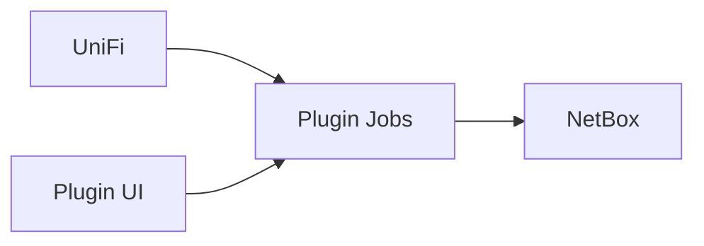

# netbox-unifi Wiki

`netbox-unifi` er et NetBox plugin til UniFi -> NetBox sync.

## Diagrammer

## Quick links

- [Installation](Installation)
- [Configuration](Configuration)
- [Run Sync](Run-Sync)
- [Release and PyPI](Release-and-PyPI)
- [Troubleshooting](Troubleshooting)

## Source docs in repository

- [README](https://github.com/ondryadev/netbox-unifi/blob/main/README.md)
- [Server install](https://github.com/ondryadev/netbox-unifi/blob/main/docs/server-install.md)
- [Configuration](https://github.com/ondryadev/netbox-unifi/blob/main/docs/configuration.md)
- [Troubleshooting](https://github.com/ondryadev/netbox-unifi/blob/main/docs/troubleshooting.md)
- [Release](https://github.com/ondryadev/netbox-unifi/blob/main/docs/release.md)
